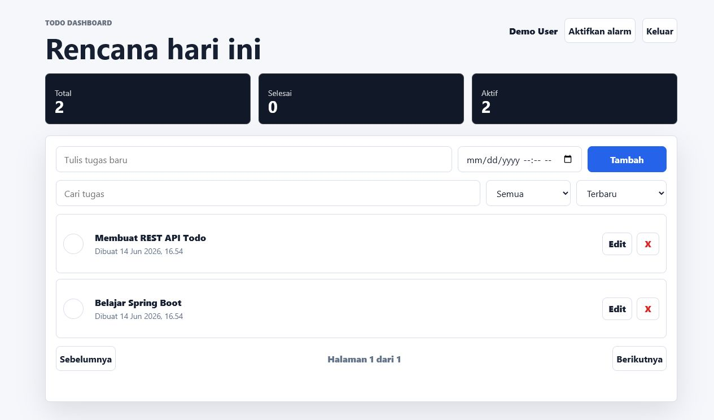

# TodoFlow

Full-stack Todo dashboard untuk mengelola tugas pribadi dengan autentikasi JWT, reminder browser, PostgreSQL, database migration, automated tests, Docker, dan CI.



## Highlights

- Register dan login dengan password BCrypt
- Stateless authentication menggunakan JWT
- CRUD Todo dengan kepemilikan data per user
- Search, filter, sorting, dan pagination
- Due date, reminder, browser notification, dan alarm
- Responsive dashboard tanpa framework frontend
- H2 untuk development cepat
- PostgreSQL untuk environment production-like
- Flyway untuk versioned database migration
- Health endpoint dengan Spring Boot Actuator
- Test integrasi dengan Spring Boot, MockMvc, dan Spring Security
- Docker multi-stage build dan Docker Compose
- GitHub Actions untuk test dan Docker build

## Tech Stack

| Area | Technology |
| --- | --- |
| Backend | Java 21, Spring Boot 4 |
| Security | Spring Security, OAuth2 Resource Server, JWT, BCrypt |
| Database | PostgreSQL, H2, Spring Data JPA, Hibernate |
| Migration | Flyway |
| Frontend | HTML, CSS, Vanilla JavaScript |
| Testing | JUnit 5, MockMvc, Spring Security Test |
| Operations | Docker, Docker Compose, Actuator, GitHub Actions |

## Architecture

```text
Browser Dashboard
       |
       | HTTP + JSON + Bearer JWT
       v
Spring Security Filter Chain
       |
       v
Controller -> Service -> Repository -> PostgreSQL / H2
                                  |
                                  v
                           Flyway Migration
```

Backend memakai struktur berlapis:

- `Controller`: kontrak HTTP dan validasi request
- `Service`: business logic dan pembatasan ownership
- `Repository`: query database dengan Spring Data JPA
- `Entity`: representasi tabel database
- `DTO`: bentuk request dan response API

## Quick Start

### Development dengan H2

Kebutuhan: JDK 21.

```powershell
git clone <repository-url>
cd todo-api
.\mvnw.cmd spring-boot:run
```

Linux/macOS:

```bash
./mvnw spring-boot:run
```

Buka [http://localhost:8080](http://localhost:8080).

Demo account untuk profile `dev`:

```text
Email: demo@example.com
Password: password123
```

### Full Stack dengan Docker

```bash
docker compose up --build
```

Docker Compose menjalankan aplikasi dan PostgreSQL. Untuk konfigurasi sendiri:

```bash
cp .env.example .env
docker compose up --build
```

Hentikan service:

```bash
docker compose down
```

Hapus juga volume database:

```bash
docker compose down -v
```

## Environment Variables

| Variable | Description |
| --- | --- |
| `JWT_SECRET` | Secret HMAC JWT, minimal 32 karakter |
| `JWT_EXPIRATION_MINUTES` | Masa berlaku token dalam menit |
| `DATABASE_URL` | JDBC URL PostgreSQL |
| `DATABASE_USERNAME` | Username PostgreSQL |
| `DATABASE_PASSWORD` | Password PostgreSQL |
| `POSTGRES_DB` | Database untuk Docker Compose |
| `POSTGRES_USER` | User untuk Docker Compose |
| `POSTGRES_PASSWORD` | Password untuk Docker Compose |
| `APP_PORT` | Port aplikasi dari Docker Compose |

Jangan commit file `.env`. Gunakan [.env.example](.env.example) sebagai template.

## API

### Authentication

| Method | Endpoint | Access |
| --- | --- | --- |
| `POST` | `/api/auth/register` | Public |
| `POST` | `/api/auth/login` | Public |

### Todos

| Method | Endpoint | Description |
| --- | --- | --- |
| `GET` | `/api/todos` | List Todo user |
| `GET` | `/api/todos/{id}` | Detail Todo |
| `POST` | `/api/todos` | Buat Todo |
| `PUT` | `/api/todos/{id}` | Edit Todo |
| `DELETE` | `/api/todos/{id}` | Hapus Todo |

Endpoint Todo membutuhkan:

```http
Authorization: Bearer <access-token>
```

Query list yang didukung:

```text
page, size, sortBy, direction, completed, q
```

Contoh:

```text
/api/todos?completed=false&q=spring&page=0&size=10&sortBy=dueAt&direction=asc
```

Request Todo:

```json
{
  "title": "Belajar Spring Security",
  "completed": false,
  "dueAt": "2026-06-15T02:00:00Z"
}
```

Response Todo:

```json
{
  "id": 1,
  "title": "Belajar Spring Security",
  "completed": false,
  "createdAt": "2026-06-14T08:00:00Z",
  "dueAt": "2026-06-15T02:00:00Z"
}
```

## Health Check

```text
GET /actuator/health
```

Contoh response:

```json
{
  "status": "UP"
}
```

## Testing

Windows:

```powershell
.\mvnw.cmd test
```

Linux/macOS:

```bash
./mvnw test
```

Test mencakup:

- Register dan login
- Password hashing
- Validation error
- Akses endpoint dengan dan tanpa JWT
- CRUD Todo
- Ownership antar-user
- Pagination, search, sorting, dan filter
- Penyimpanan reminder `dueAt`

## Build

```bash
./mvnw clean package
java -jar target/todo-api-0.0.1-SNAPSHOT.jar
```

Docker image:

```bash
docker build -t todoflow .
docker run --rm -p 8080:8080 todoflow
```

## Database Migration

Migration berada di:

```text
src/main/resources/db/migration/
```

- `V1__create_users_and_todos.sql`
- `V2__add_due_at_to_todos.sql`

Flyway menjalankan migration sebelum Hibernate memvalidasi schema.

## Security Notes

- Password tidak disimpan sebagai plain text.
- User hanya dapat mengakses Todo miliknya sendiri.
- Endpoint Todo memerlukan JWT valid.
- Secret dan kredensial production harus diberikan melalui environment variables.
- Demo user hanya dibuat pada profile `dev`.
- Reminder saat ini berjalan ketika dashboard terbuka di browser.

## Project Structure

```text
src/main/java/com/taqin/todoapi/
|-- auth/       Authentication, JWT, user, security config
|-- todo/       Todo controller, service, repository, DTO, errors
`-- TodoApiApplication.java

src/main/resources/
|-- db/migration/   Flyway SQL
|-- static/         Dashboard HTML, CSS, JavaScript
`-- application-*.properties
```

## Roadmap

- Refresh token dan token revocation
- Email atau push reminder dari backend scheduler
- OpenAPI/Swagger documentation
- Role-based authorization
- Deploy public demo
- Observability dengan metrics dan structured logging

## License

Project ini menggunakan [MIT License](LICENSE).
